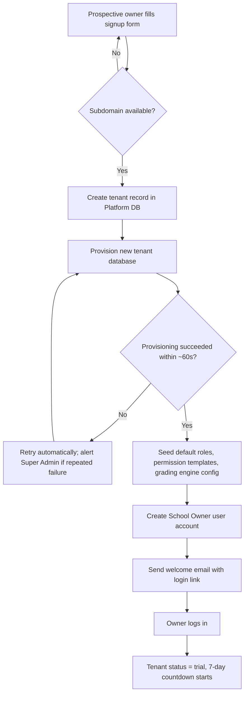
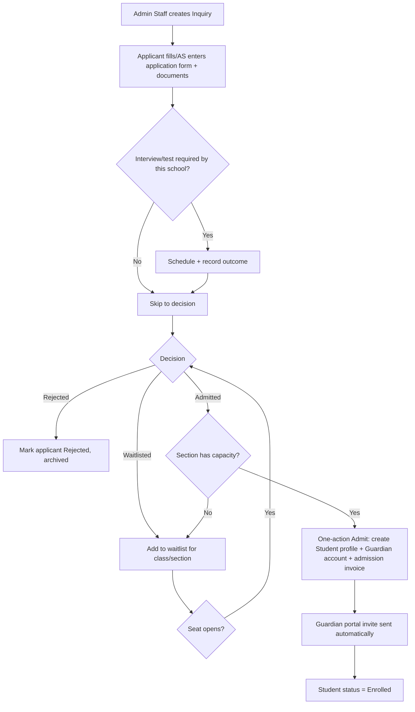
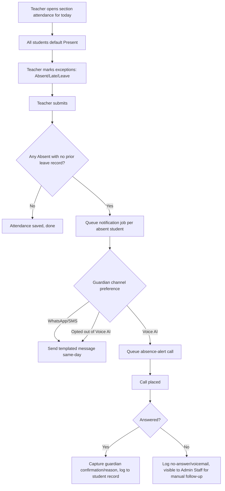
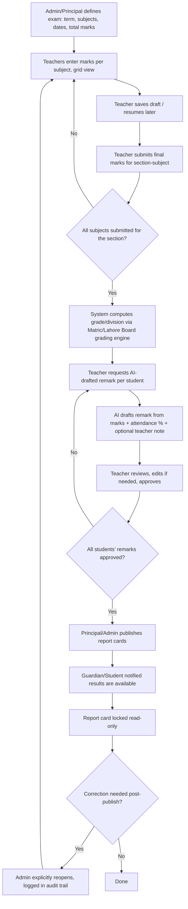
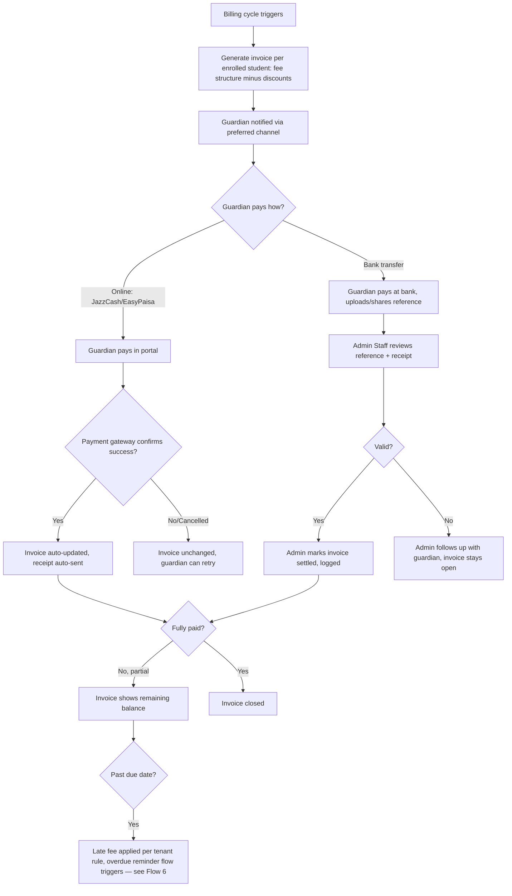
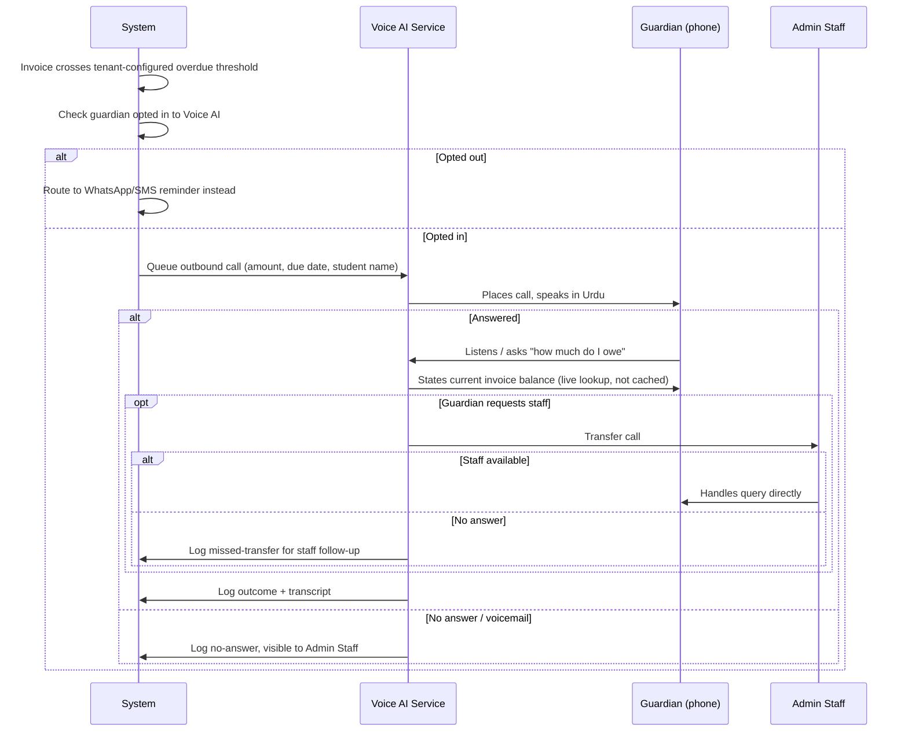

# Phase 4 — User Flows

**Status:** Draft v1 for review
**Depends on:** [Phase 2 Feature Breakdown](./02-feature-breakdown.md),
[Phase 3 User Stories](./03-user-stories.md)

These are the end-to-end flows behind Phase 3's stories, sequenced step by
step. Diagrams use Mermaid (renders natively on GitHub). Each flow calls out
the failure/edge branches explicitly — those branches are what Phase 5
(Database Design) and Phase 7 (API Design) have to support, not just the
happy path.

---

## 1. Tenant Signup → First Login

**Edge cases:** subdomain collision, provisioning timeout/failure (must not
leave a half-created tenant visible to the owner), owner never completes
first login (trial clock still runs — reminder emails per Phase 3 A2 still
fire).

---

## 2. Admission → Enrollment

**Edge cases:** section fills up between admit-decision and the Admit
action (re-check capacity at the moment of admit, not just at decision
time), duplicate applicant (same CNIC/B-form already a student — flag,
don't silently create a duplicate), guardian already exists as a portal user
for a sibling (link, don't create a second account).

---

## 3. Daily Attendance → Notification

**Edge cases:** same-day attendance correction (student marked absent by
mistake, corrected before notification job runs — job should check
current state at send time, not stale state at mark time), notification
failure (WhatsApp/SMS provider down — must not fail silently, needs a
retry/visible-failure path), a student with a pre-approved leave for today
should not trigger an absence alert at all.

---

## 4. Exam → Marks → AI-Assisted Report Card → Publish

**Edge cases:** a subject teacher never submits marks (exam can't fully
publish — needs a clear "incomplete" state Admin can see, not a silent
gap), AI draft requested but teacher never approves it (report card must
not publish with an unapproved/blank remark — either block publish or
publish without a remark, a decision for Phase 5/module design, not
silently substituting the AI draft unapproved), reopening a published
report card for one student vs. the whole section (scope of the reopen
action needs to be explicit).

---

## 5. Fee Invoice → Payment (Online and Bank Transfer)

**Edge cases:** partial payment via one channel then remainder via another
(must reconcile against the same invoice, not create confusion across two
payment records), duplicate bank-transfer confirmation (same reference
entered twice), payment received after a Voice AI reminder was already
queued (cancel the queued reminder, don't call someone who already paid).

---

## 6. Overdue Fee → Voice AI Reminder

**Edge cases:** guardian pays mid-call (system should not let the agent
insist on an amount that's already been paid — this argues for a real-time
balance check, not a value baked in when the job was queued), repeated
no-answer (should the system retry, and how many times, before falling
back to WhatsApp/SMS — a tenant-configurable policy, not hardcoded), a
guardian who's annoyed by calls and disables Voice AI mid-flow (in-flight
queued calls for that guardian must respect the new preference, not fire
anyway).

---

## Cross-flow notes for later phases

- Every flow above that "notifies" a guardian routes through the single
  **Notification Engine** from Phase 2 §H — these diagrams don't repeat its
  internals per flow to avoid drift; see that section for the shared design.
- Every flow with an irreversible/hard-to-undo step (promotion, report card
  publish/reopen, tenant suspension) needs an explicit confirmation step in
  the UI and an audit log entry — called out per-flow above, formalized as a
  cross-cutting requirement in Phase 5/7.

## Next step

**Phase 5 — Database Design** turns these flows and Phase 3's acceptance
criteria into actual tables, states, and relationships — starting with the
Platform DB / Tenant DB split from Phase 1 §6.
