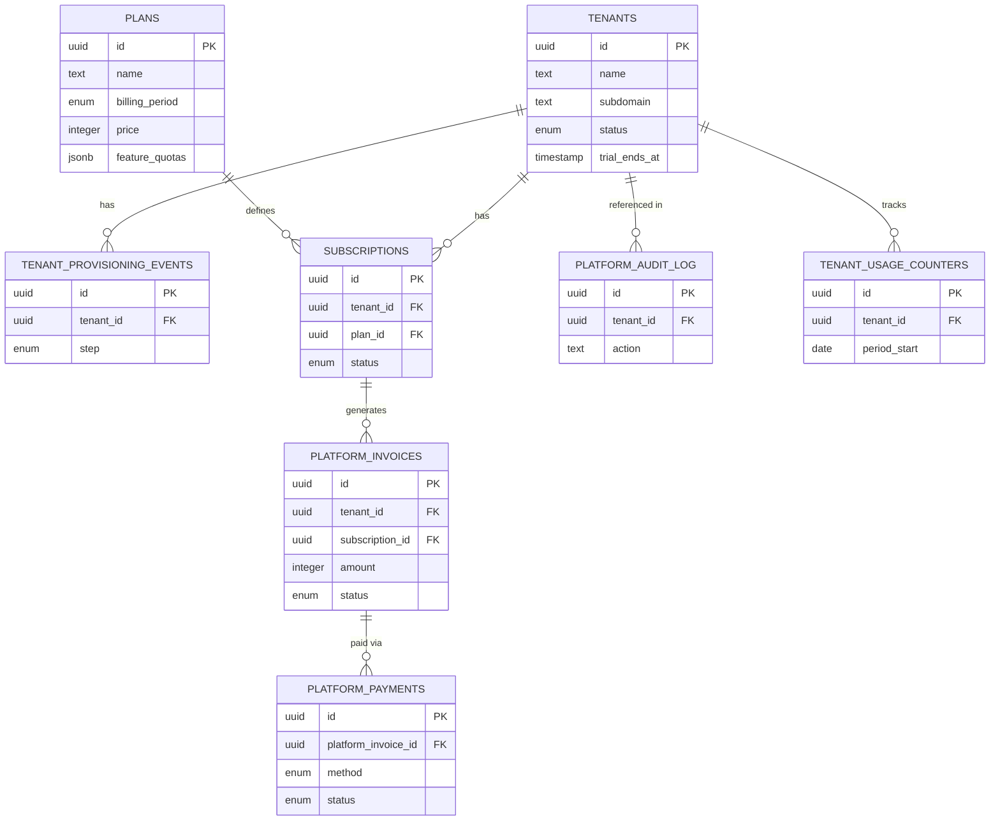
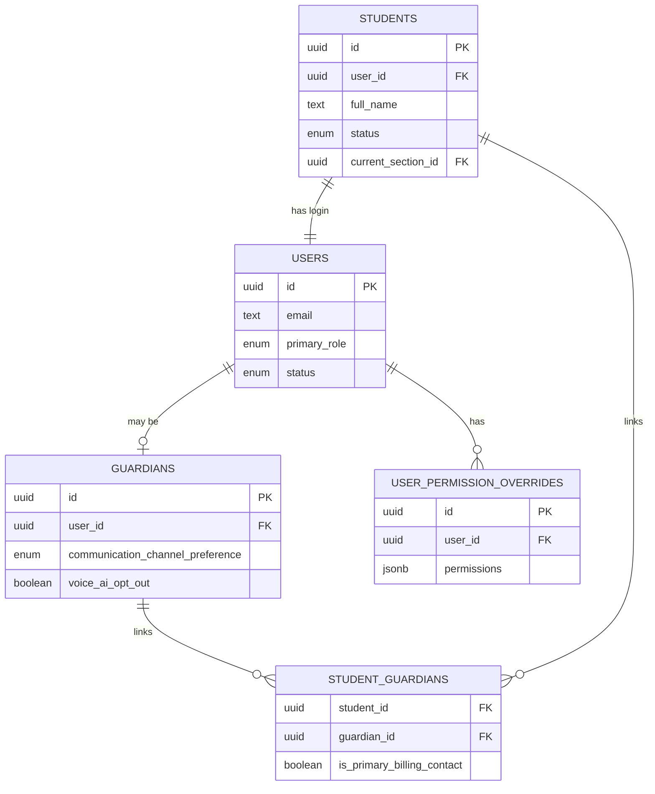
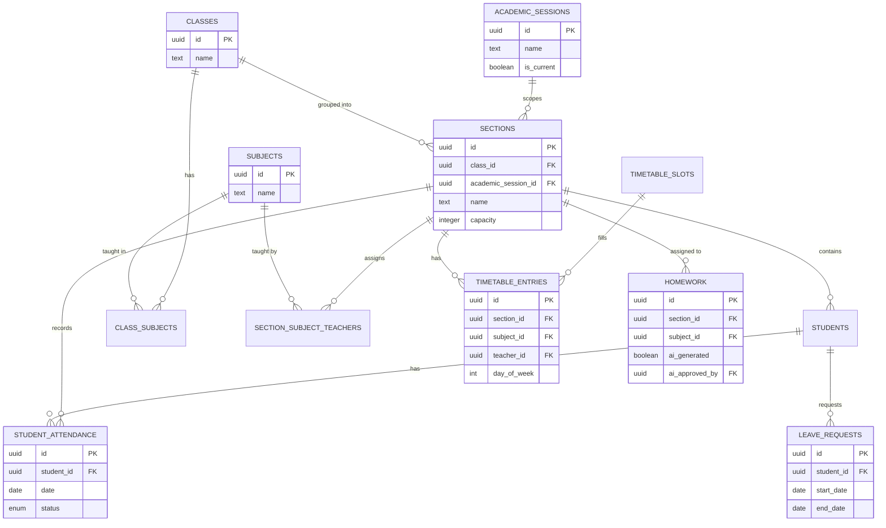
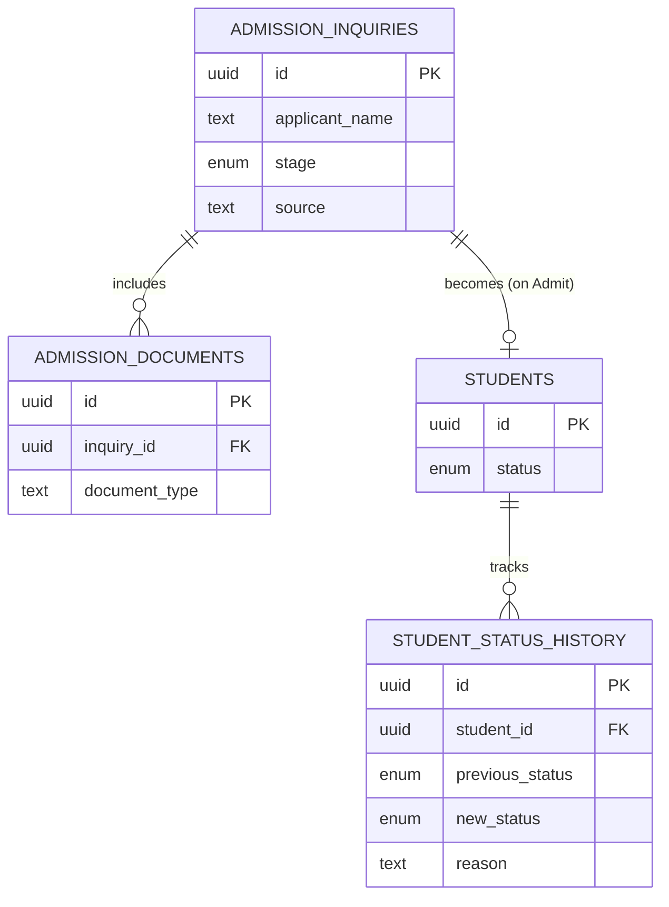
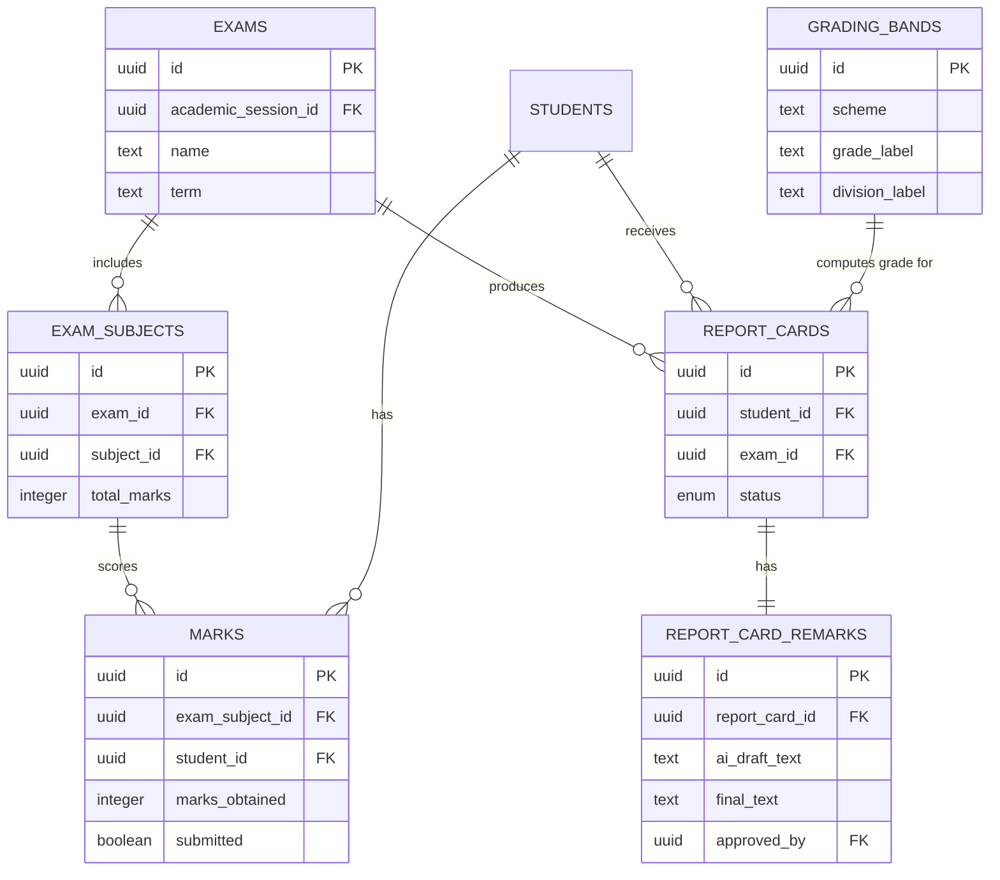
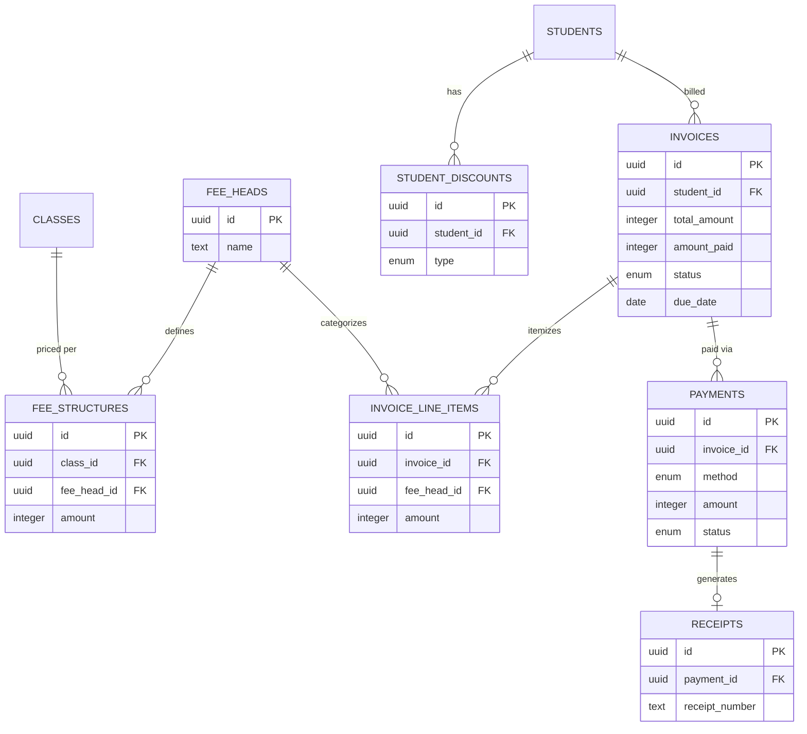
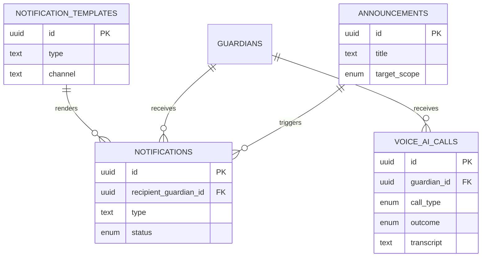

# Phase 6 — ER Diagram

**Status:** Draft v1 for review
**Depends on:** [Phase 5 Database Design](./05-database-design.md)

Visual form of Phase 5's tables. Mermaid `erDiagram` syntax, renders natively
on GitHub. The Tenant DB is split into five smaller diagrams grouped by
domain (Identity/People, Academic Operations, Admissions, Exams/Report
Cards, Finance, Communication) instead of one giant diagram — easier to
actually read, at the cost of `students`/`guardians` appearing as shared
reference entities in more than one diagram. That repetition is intentional,
not drift — Phase 5 remains the single source of truth for column-level
detail.

---

## 1. Platform DB

---

## 2. Tenant DB — Identity, Access & People

Note: `STUDENTS ||--|| USERS` is a one-to-one, mandatory relationship —
this is where the "every student has a required login" decision (Phase 5
§6) is expressed visually.

---

## 3. Tenant DB — Academic Structure & Daily Operations

---

## 4. Tenant DB — Admissions

---

## 5. Tenant DB — Exams, Marks & Report Cards

Note: `REPORT_CARD_REMARKS.final_text` being nullable until `approved_by`
is set is the data-level enforcement of the AI-approval rule (Phase 3 E1) —
visible here as the one-to-one link between a report card and its remark
record, not a free-floating AI output.

---

## 6. Tenant DB — Finance

---

## 7. Tenant DB — Communication

---

## 8. What these diagrams confirm (and one thing they surface)

- The **Platform DB ↔ Tenant DB split is total** — no diagram above has an
  edge crossing between them; the only link is conceptual
  (`tenants.tenant_db_connection_ref` points at a physically separate
  database, not a foreign key).
- The **academic session backbone** (§3) is confirmed as the join point for
  nearly every other diagram — `sections`, `exams`, and (via
  `fee_structures`) finance all key off it, which is what makes year-over-
  year history survive promotion cleanly.
- One thing worth a second look once we're implementing: `STUDENTS` appears
  in four of the five domain diagrams as a hub entity. That's expected for a
  student information system, but it does mean the `students` table is the
  single highest-write-contention table in the schema (attendance, marks,
  invoices, admissions all touch it indirectly) — a note for Phase 9 to
  account for in connection pooling and query patterns, not a red flag now.

## Next step

**Phase 7 — API Design** turns these entities and relationships into actual
REST endpoints, request/response shapes, and auth rules.
